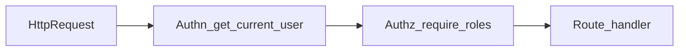
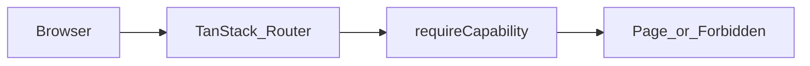

# RBAC Assignment — FastAPI + React

## Quick Start

This repository implements a role-based access model (`admin`, `manager`, `member`) on top of the full-stack FastAPI template.

If you only have a few minutes:

1. Start the stack with Docker (`docker compose watch`)
2. Login via API docs (`http://localhost:8000/docs`) or frontend (`http://localhost:5173`)
3. Validate role behavior using the permission matrix below and backend tests

Main implementation points:

- Backend authorization helpers: `backend/app/api/authz.py`
- Backend protected routes: `backend/app/api/routes/users.py`, `backend/app/api/routes/metrics.py`
- Frontend capabilities and guards: `frontend/src/lib/capabilities.ts`, route guards/components in `frontend/src/routes/` and `frontend/src/components/`

## Run Locally

### Docker (recommended)

```bash
docker compose watch
```

Services:

- Frontend: `http://localhost:5173`
- Backend API: `http://localhost:8000`
- Swagger docs: `http://localhost:8000/docs`
- Health check: `http://localhost:8000/api/v1/utils/health-check/`

## Migrations

Migrations are applied automatically on stack startup by `backend/scripts/prestart.sh` (`alembic upgrade head`).

To run manually:

```bash
docker compose exec backend bash
alembic upgrade head
```

## Seed Users

Seed users are created by `python app/initial_data.py` during backend prestart.

Role accounts:

- `admin`: `FIRST_SUPERUSER` / `FIRST_SUPERUSER_PASSWORD`
- `manager`: `SEED_MANAGER_EMAIL` / `SEED_MANAGER_PASSWORD`
- `member`: `SEED_MEMBER_EMAIL` / `SEED_MEMBER_PASSWORD`

Default local values (see `.env.test`):

- `admin@example.com`
- `manager@example.com`
- `member@example.com`

Manual seed run:

```bash
docker compose exec backend bash -lc "python app/initial_data.py"
```

## Tests

Run full backend test flow:

```bash
bash ./scripts/test.sh
```

Run tests against already running stack:

```bash
docker compose exec backend bash scripts/tests-start.sh
```

Critical RBAC coverage includes:

- `admin` can create users
- `manager` can list users but cannot create/update/delete any user
- `member` is forbidden from listing users
- `admin` and `manager` can access metrics
- `member` gets `403` on metrics

Relevant files:

- `backend/tests/api/routes/test_users.py`
- `backend/tests/api/routes/test_metrics.py`
- `backend/tests/api/test_authz.py`

## Permission Matrix

| Action | admin | manager | member |
| --- | --- | --- | --- |
| List users | yes | yes | no |
| Create user | yes | no | no |
| View metrics | yes | yes | no |
| View own profile | yes | yes | yes |
| Update own profile | yes | yes | yes |
| Update any profile | yes | no | no |

### Manual E2E checklist

Use the seeded accounts above. Expected UI and routes:

**admin**

- Sidebar: **Admin** and **Metrics** visible.
- Open `/admin`: user table loads; **Add user** (or equivalent) available.
- Open `/metrics`: page loads (stub JSON).

**manager**

- Sidebar: **Admin** and **Metrics** visible (list users, no create-user affordance).
- Open `/admin`: list works; creating users is not allowed by matrix.
- Open `/metrics`: page loads.

**member**

- Sidebar: **Admin** and **Metrics** not shown.
- Open `/metrics` directly: redirected to `/forbidden` (or equivalent access-denied UX).
- Open `/admin` directly: redirected to `/forbidden`.

## Authorization approach

Authorization is enforced in the backend with explicit FastAPI dependencies and helper functions. Route handlers declare access rules via dependencies instead of inline role checks spread across endpoint bodies. The core helpers are centralized in `backend/app/api/authz.py`.

`User.role` is the authorization source of truth for this assignment (`admin`, `manager`, `member`). The legacy `is_superuser` flag from template baseline is still present for compatibility, and mapping to effective admin behavior is handled in one backend layer, not scattered through route code.

Frontend uses role-based capability helpers to drive UX decisions (navigation visibility, page access, action buttons). These checks improve usability and prevent confusing flows, but they are not a security boundary.

Security guarantees are backend-first: direct API calls still hit backend authorization checks and return `403 Forbidden` when access is denied.

### Extending roles (MVP trade-off)

Adding a fourth role is intentionally not a one-line change: you would extend the role enum and policies in `backend/app/api/authz.py`, mirror capabilities in `frontend/src/lib/capabilities.ts`, update the permission matrix in this README, and adjust tests. That is expected for a small RBAC MVP rather than a dynamic policy engine.

## Regenerate frontend API client

After backend OpenAPI schema changes, regenerate the typed client under `frontend/src/client/`. Full steps (automatic script, manual dump, `bun run generate-client`) are documented in [`frontend/README.md`](frontend/README.md) in the **Generate Client** section. From the repo root:

```bash
bash ./scripts/generate-client.sh
```

## Design note (dependency-based RBAC)

**Context:** The template already used FastAPI dependencies for authentication; extending that pattern for role checks keeps each endpoint’s policy visible at declaration time.

**Decision:** Enforce access with small reusable dependencies in `backend/app/api/authz.py` and derive UI behavior from `getCapabilities(role)` on the frontend. Do not rely on the SPA as the security boundary.

**Trade-off:** Simpler than a policy engine or permission tables; adding a new role touches a bounded set of files (see above), which is acceptable for this assignment.





## Additional Docs

- Assignment checklist and progress: `docs/README.md`
- RBAC model and policy context: `docs/rbac-model.md`
- Architecture guardrails: `docs/arch.md`
- Backend developer docs: `backend/README.md`
- General development docs: `development.md`
